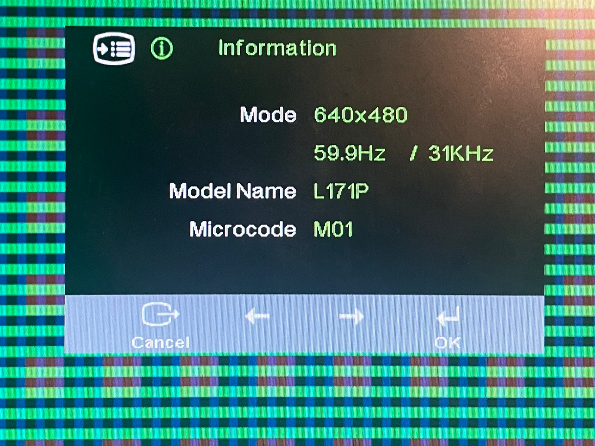
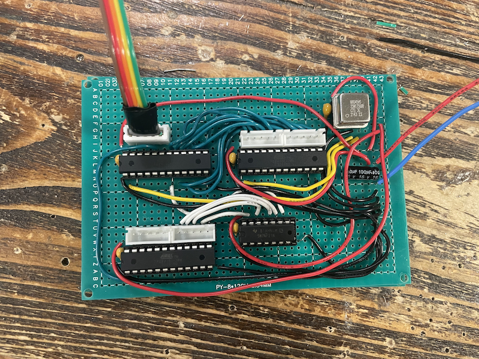

# 22V10 VGA Card

I had some ATF22V10C's lying around and tossed together a quick VGA card:

### The Gist

> :information_source: **NOTE**: I happen to have a few **25.175MHz "Standard
> Clock" TCXO's and a pile of PLD's** lying around. Admittedly, this is a
> somewhat luxurious state of affairs. On the one hand, it makes the
> implementation significantly more straightforward. On the other, those aren't
> likely to be _super_ common "just lying around" parts for home hackers...

 - Pixel Clock: 25.175MHz
 - Resolution: 640x480
 - Refresh: 59.9Hz
 - 3 x ATF22V10C's
 - 1 x SN74SL21 (Dual, 4-input, positive, `AND`)

The POC is some pretty shoddy wire-pasta, but it works brilliantly...and is fun:

## Development

 - Written for GALasm (I use **[Galette](https://github.com/simon-frankau/galette)**)
 - Programmed with a T48 using **[Minipro](https://gitlab.com/DavidGriffith/minipro)**
 - For help: `make help`
 - To build and upload a unit: `UNIT=<my-file.pld> make clean compile upload`

### PLD Sources

> :information_source: **Schematic**: [PDF](./doc/22V10C-VGA-Card.pdf) / [SVG](./doc/22V10C-VGA-Card.svg)

 - `VGASync.pld` (ATF22V10C): HSync, VSync, Visible, and VBlank
 - `mod800.pld` (ATF22V10C): `% 800` counter
 - `mod525.pld` (ATF22V10C): `% 525` counter
 - Four-input `AND` on (`V32`, `V64`, `V128`, `V256`)

## Notes

 - I'm sure it's possible to reduce chip-count — e.g. moving some of the sync
   counter logic from one IC into `VGASync.pld` / using some outputs in
   tri-state mode — or make this more elegant. This isn't the _optimal_ solution;
   it's just the easiest off-the-cuff solution with the proper timing.
 - Pinouts: _these are malleable!_ The current version is informed by where the
   IC's happened to land on my breadboard, more than anything. **Just mind your
   product terms!** (The number of product terms available to each macrocell
   varies by pin).

## Misc

### Other PLD files

 - `counter.pld`: Generic 10-bit synchronous counter.
 - `eq-9-bit.pld`: Bit-wise comparison, 9-bits.

### Fun

#### Analog Switch Pixel Gate

Use the `Visible` output of `VGASync` to toggle 3 x SPST or SPDT switches for
red, green, and blue.

> :warning: **NOTE**: Watch your propagation delays!
>    
> If you use an analog switch that has a large ON/OFF (or Inhibit)
> propagation delay, relative to the pixel clock, you'll want to turn it
> on and off <i>early</i> to avoid offsetting your pixels horizontally.

#### Boolean Grids

Have some fast CMOS or TTL logic gates lying around? Taking the output from one
or more bits from `VAddr` and `HAddr`, passing them through some gates, and
`AND`'ing them with the `Visisble` flag is a great way to check your pixel
alignment.

